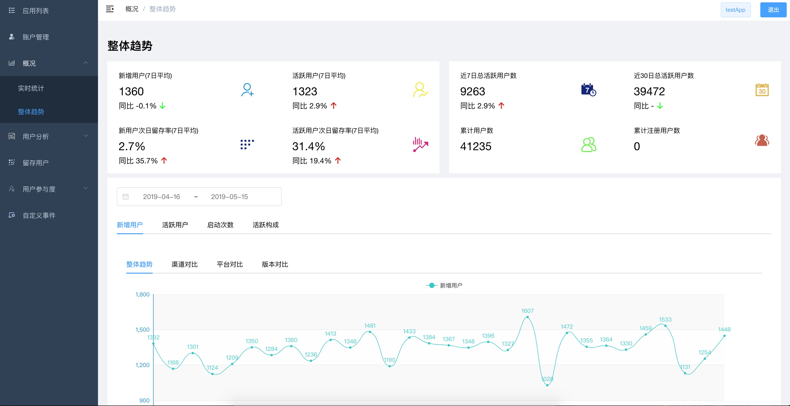

<h1 align="center"> GoAnalytics </h1>

### 项目介绍

GoAnalytics是基于go实现的一个数据统计平台，用于统计移动端的数据指标，比如启动次数、用户增长、活跃用户、留存等指标分析。
前端数据展示项目是 [goanalytics-web](https://github.com/lt90s/goanalytics-web)。
目前正在积极开发中，欢迎提交新的需求和pull request。



### 特性

* 数据实时分析展示
* 用户相关基本指标：增长、留存、活跃、启动等
* 渠道、平台、版本交叉对比
* 自定义事件统计
* 轻量

### 构建

Go版本需要支持module，本地开发测试
```
# 开启mongodb

git clone https://github.com/lt90s/goanalytics
cd goanalytics
go get -v

# 创建管理员账号
cd cmd/account
go build
./account

# 启动goanalytics-web项目，参考 https://github.com/lt90s/goanalytics-web
# 登录管理员账号创建新应用会生成 AppId


# 生成测试数据
cd cmd/test_data
go build
./test_data -appId AppId （上一步中生成的AppId)

# 现在就可以在浏览器中看到数据展示
```

`cmd/goanalytics_kafka`和`goanalytics_rmq`是分别基于`kafka`和`rocketmq`的发布订阅功能做的数据发布
和订阅处理，横向扩展能力比`local`高。另外由于`rocketmq`还没有原生基于`go`的客户端（原生客户端正在开发中
[2.0.0 road map](https://github.com/apache/rocketmq-client-go/issues/57))，可能会存在问题。


### 开发

项目结构

<pre>
├── README.md
├── api
│   ├── authentication          用户认证、管理API
│   ├── middlewares             GIN 中间件
│   └── router                  API route
├── cmd
│   ├── account                 生成admin账号命令
│   ├── analytic_local          不依赖消息系统的goanalytics
│   ├── goanalytics_kafka       基于kafak的goanalytics
│   ├── goanalytics_rmq         基于rocketmq的goanalytics
│   └── test_data               生成测试数据命令
├── common
│   └── data.go
├── conf                        配置
│   └── conf.go
├── event
│   ├── codec                   数据编解码
│   └── pubsub                  消息发布订阅
├── go.mod
├── go.sum
├── metric                      所有的统计指标在这里实现
│   ├── init.go
│   └── user                    用户相关指标的实现
├── schedule
│   └── schedule.go             定时任务调度
├── storage                     存储模块
│   ├── counter.go              计数器接口
│   ├── data.go
│   └── mongodb                 基于mongodb实现的存储及计数器
└── utils
    ├── date.go
    ├── date_test.go
    ├── errors.go
    └── key.go
</pre>